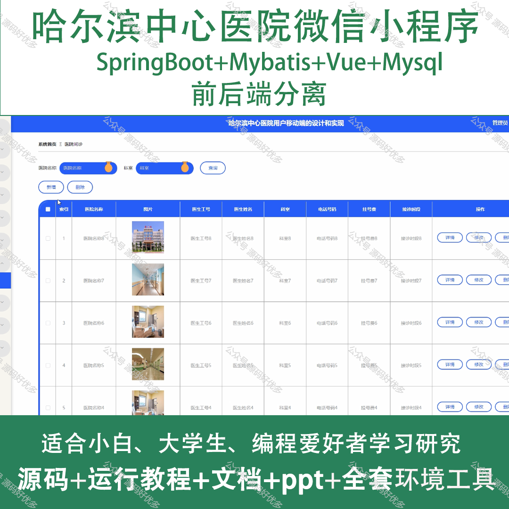
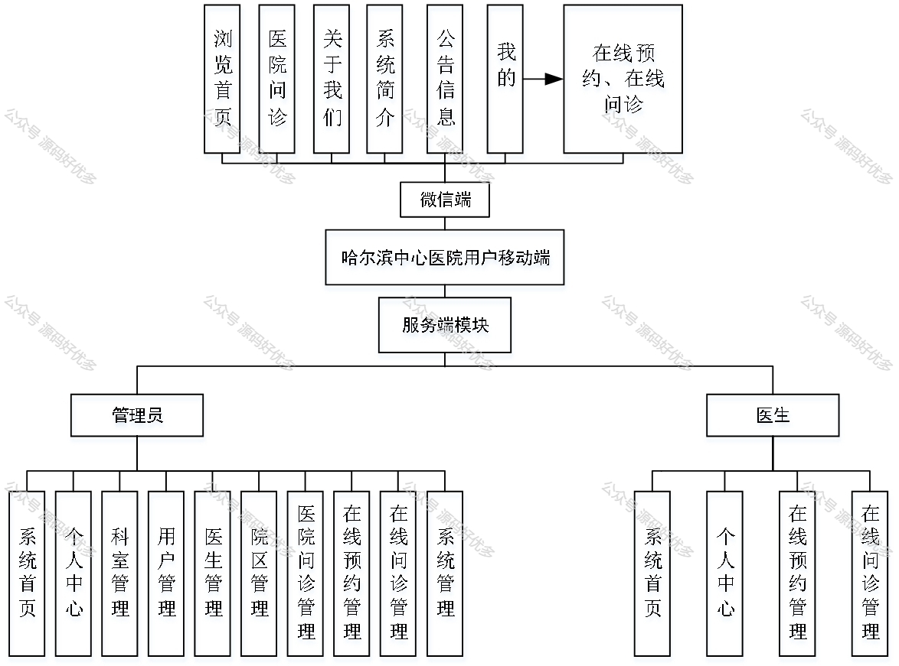
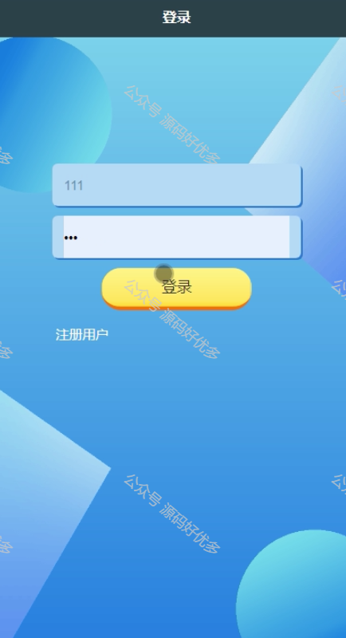
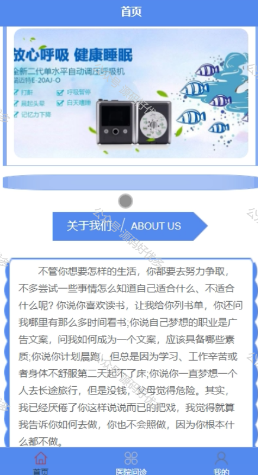
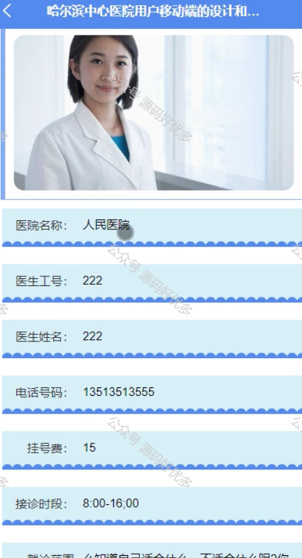
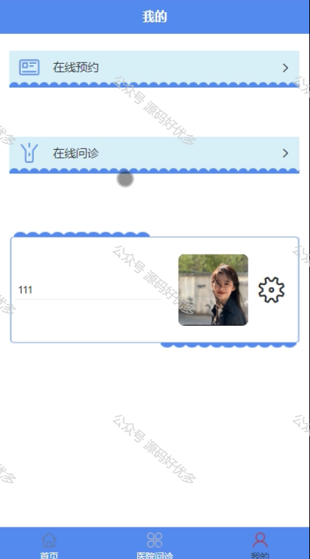
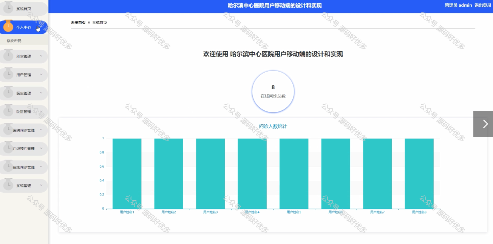
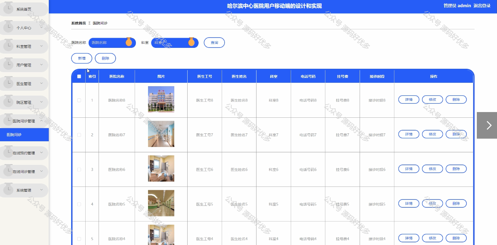
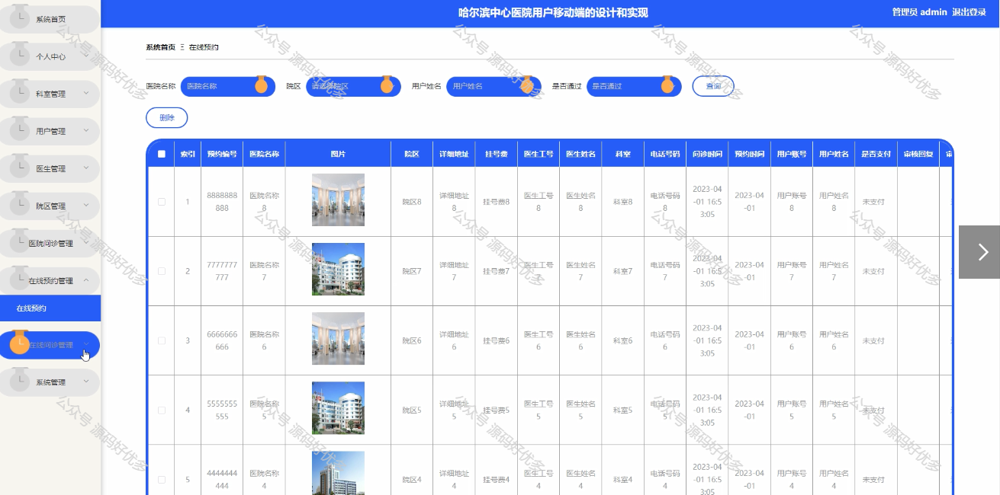
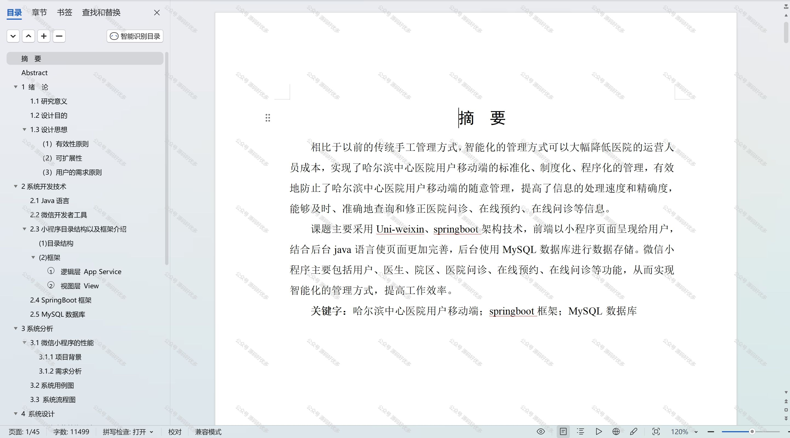

 
## 查看主页获取源码

> **作者介绍**： **✌**全网粉丝10W+本平台特邀作者、博客专家、CSDN新星计划导师、java领域优质创作者,博客之星、掘金/华为云/阿里云/InfoQ等平台优质作者、专注于项目实战 **✌**

  

### 一、作品包含

源码+数据库+设计文档万字+PPT+全套环境和工具资源+部署教程

### 二、项目技术

前端技术：Html、Css、Js、Vue、Element-ui

数据库：MySQL

后端技术：Java、Spring Boot、MyBatis

  

### 三、运行环境

开发工具：IDEA/eclipse + 微信开发者工具

数据库：MySQL5.7

数据库管理工具：Navicat10以上版本

环境配置软件： JDK1.8+Maven3.6.3

前端Nodejs：14

### 四、项目介绍
项目编号：mpweixinA029

哈尔滨中心医院微信小程序是一款为患者提供便捷就医服务的移动应用平台，旨在通过微信这一广泛使用的社交工具，让患者能够更加方便地获取医疗服务，减少排队等待时间，提高就医体验。小程序的推出，不仅优化了医院的服务流程，还加强了医患之间的沟通，为哈尔滨市民提供了一个高效、贴心的医疗健康服务平台。

前台用户功能：浏览首页、医院问诊、关于我们、系统简介、公告信息、在线预约、在线问诊。

后台分为管理员和医生
管理员的功能：系统首页、个人中心、科室管理、用户管理、医生管理、院区管理、医院问诊管理、在线预约管理、在线问诊管理、系统管理。
医生的功能：系统首页、个人中心、在线预约管理、在线问诊管理。

### 五、运行截图

  
